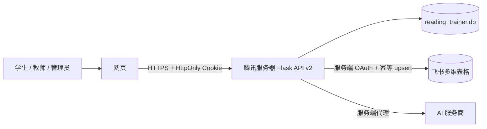

# Reading Trainer 服务器与飞书数据改造报告

> 日期：2026-08-06
> 适用版本：`ielts-toefl-reader.html?v=20260806-server-db`

## 结论

Reading Trainer 已从“浏览器 localStorage 为主存储”改为“腾讯服务器数据库为主、飞书多维表格为同步副本”。浏览器只保留当前页面运行所需的内存状态，不再调用 `localStorage.setItem` 或 `sessionStorage.setItem` 保存业务数据。

这是项目不可回退的数据契约。今后所有功能修改都必须先写入服务器，再由服务器同步飞书；服务器写入失败时不得降级为浏览器本地保存。项目已增加 `AGENTS.md` 和 `scripts/check_persistence_contract.py`，用于阻止后续修改重新引入本地持久化。

## 新数据流

### 主库

- 文件：腾讯服务器 `/home/ubuntu/resume-screener/reading_trainer.db`
- 与原项目 `resumes.db` 完全隔离。
- 数据库权限设置为 `600`。
- 存储账号密码哈希、会话哈希、邀请码、班级、学习设置、收藏、生词、错题、成绩和文章库。
- 密码使用带随机盐的 PBKDF2-SHA256；旧 SHA-256 哈希仅用于迁移兼容。
- 登录状态使用 HttpOnly、Secure、SameSite=Lax Cookie，浏览器脚本不能读取会话令牌。

### 飞书副本

- 同步方式：按稳定业务键创建或更新。
- 永不执行远端删除；飞书独有记录保留并计入 `remote_only`。
- 每条记录增加 `业务键`、`数据类型`、`数据JSON`，便于幂等核对和保留完整业务结构。
- 不同步管理员账号，也不写入密码、密码哈希、API Key、OAuth Token、Cookie 或会话。
- 文章库和收藏可共用一张飞书表，通过 `数据类型` 区分。

## 权限范围

- 学生：只读取和修改自己的学习记录。
- 教师：读取自己和名下学生的数据，可按班级关系访问。
- 管理员：管理账号、邀请码、班级、AI 配置和飞书同步。
- 管理员账号不会出现在普通账号列表或飞书账号表中。

## 密钥处理

- 管理员凭据迁移到服务器私有 `.env`，源代码不再提供可用的硬编码默认密码。
- AI Key 存入服务器 `private_config`，接口只返回 `hasKey` 布尔值。
- 飞书 Access Token 与 Refresh Token 保存在服务器 `.feishu_oauth_tokens.json`。
- 所有私密文件均不应提交 Git。

## 旧数据迁移

1. 服务器首次启动会读取旧 `.reading_trainer_state.json`，导入账号、邀请码、班级和非敏感配置。
2. 旧 AI 配置直接从服务器文件迁入私有配置表，不经过浏览器，也不进入飞书。
3. 用户登录后，网页只读检查旧浏览器键；列表数据与服务器数据取并集，设置以服务器值优先。
4. 只有服务器写入成功后才删除对应旧浏览器副本。
5. 发生冲突或服务器失败时保留旧副本，不先删数据。

## 自动化验证

- 后端接口测试：10 项通过。
- JavaScript 语法检查：通过。
- HTML 中浏览器持久化写入检查：无 `localStorage.setItem` / `sessionStorage.setItem`。
- 服务器迁移预演：3 个普通账号、14 个邀请码进入独立数据库。
- 飞书同步预演：0 条删除。
- `resumes.db` 发布前后校验值必须一致。

## 备份与恢复

生产发布前备份目录：

`/home/ubuntu/backups/reading-trainer-20260806-224029/`

备份包含旧 `app.py`、网页目录、旧 JSON 状态、飞书 OAuth 凭证和私有环境配置。需要回滚时，应先停止 Flask，再从该目录恢复对应文件；不要覆盖或删除 `resumes.db`。

## 后续建议

1. 在飞书开放平台把正式 OAuth 回调白名单设置为 HTTPS 地址。
2. 为 `reading_trainer.db` 增加每日加密备份和保留策略。
3. 将当前单文件前端逐步拆分为模块，并把 API 契约加入持续集成。
4. 增加同步失败告警和飞书 Token 到期提醒。
